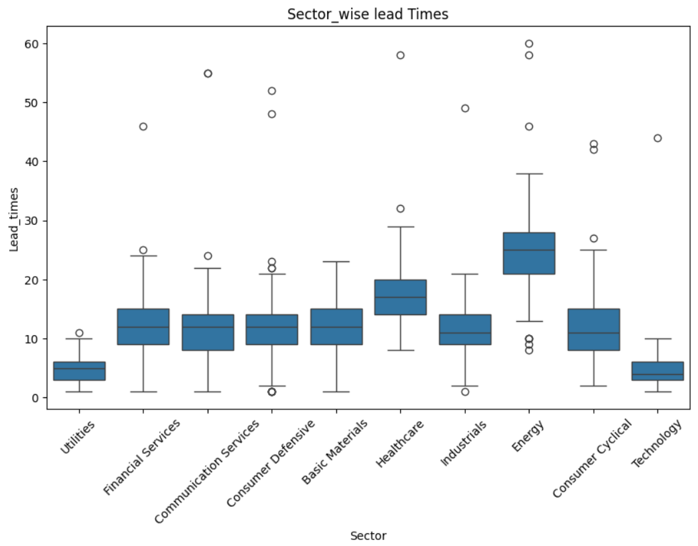

# 📊Supply Chain ESG Risk Analysis

## Project Objective
Analyze supplier risk using ESG scores, geopolitical risk, and supply chain data to identify high-risk suppliers and sectors.

## [Data sets](https://drive.google.com/drive/folders/15TpAQFVULgdmsL5SiO0QZa2RVfFbuz9M?usp=sharing)

The goal is to:
- Identify high-risk suppliers.
- Analyze sector-level risk exposure.
- Build a machine learning model to predict supplier risk.
- Create a Power BI dashboard for interactive insights.

🛠️ Project Workflow
1️⃣ Data Preparation
## Supply Chain Data (Synthetic):
- Supplier transactions (lead time, revenue, availability, stock levels).
- Manufacturing & logistics details (production volumes, transport modes, shipping costs).
- Quality control (inspection results, defect rates, delivery reliability).
##ESG Data (Downloaded):
- Environmental, Social, Governance risk scores.
- Sub-scores: Environment, Social, Governance.
- Controversy level & ESG risk percentile.
##Geopolitical Data:
- Global Political Risk Index per supplier region.

2️⃣ Data Cleaning

- Removed missing & duplicate values.

- Standardized supplier IDs across all datasets.

- Merged supply chain, ESG, and geopolitical datasets.

- Created a final master dataset with 60+ features per supplier.

3️⃣ Exploratory Data Analysis (EDA)

##Sector Analysis:

- Energy sector had the highest lead times and highest ESG risk scores.

- Manufacturing sector showed moderate risk but better delivery reliability.
  

## Correlation Insights:

- Higher ESG risk scores often correlated with longer lead times.

- High geopolitical risk regions had more supplier delays.

## Risk Distribution:

- Majority of suppliers were low-to-medium risk.

- High-risk suppliers concentrated in specific sectors and regions.
  

